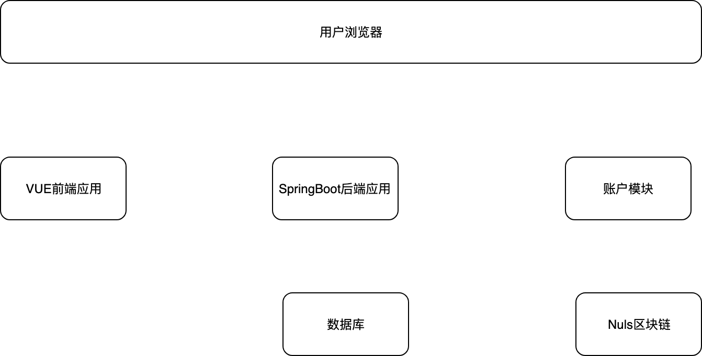
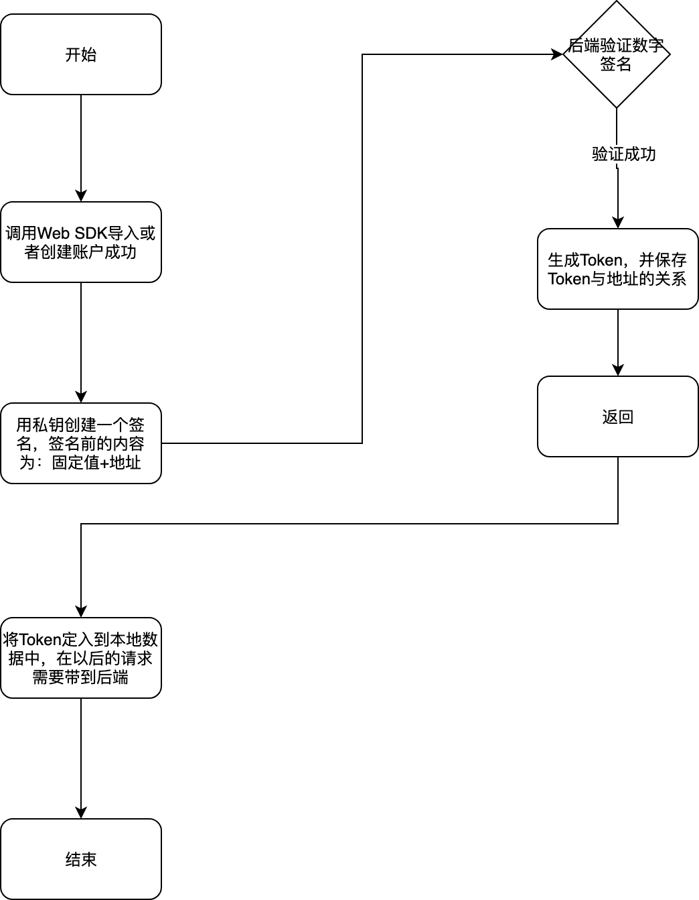
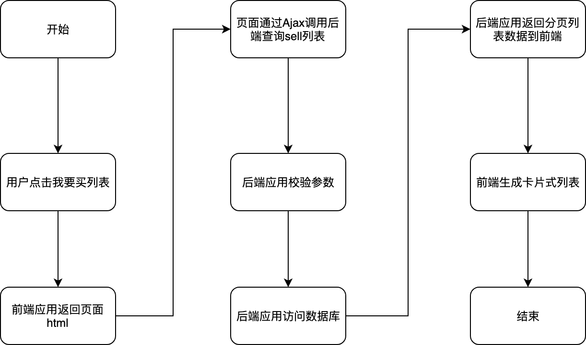
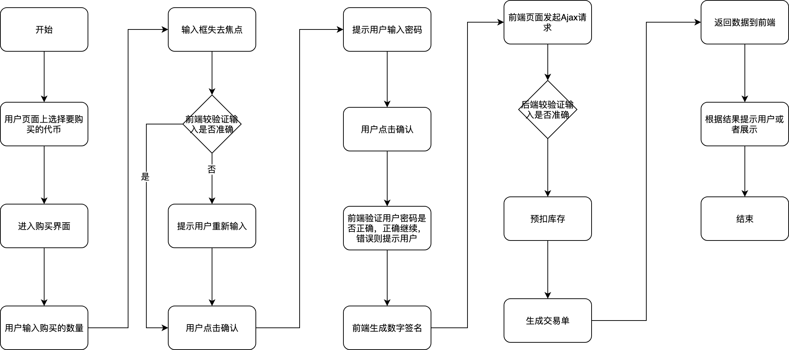
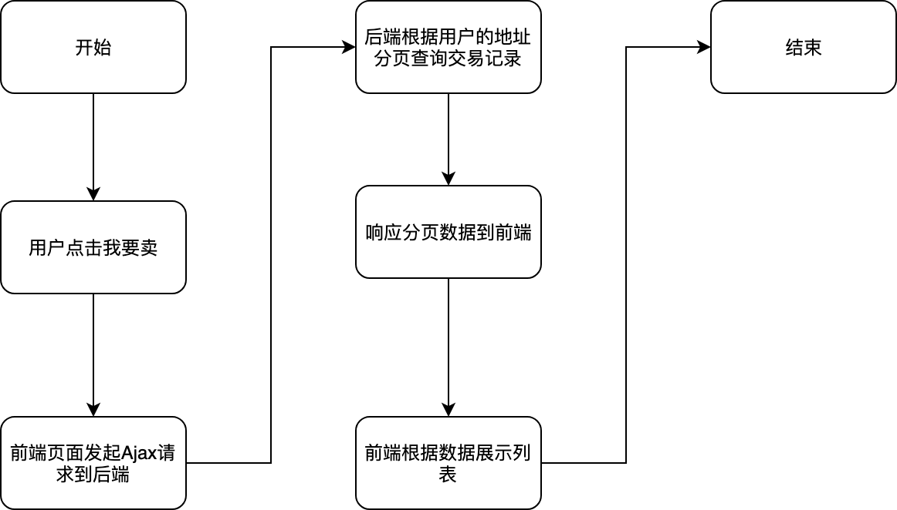
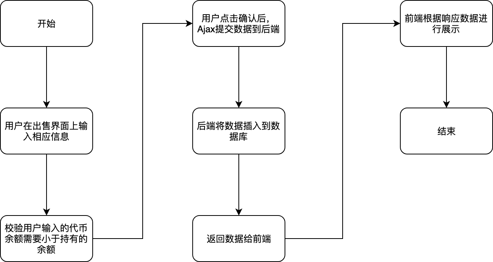
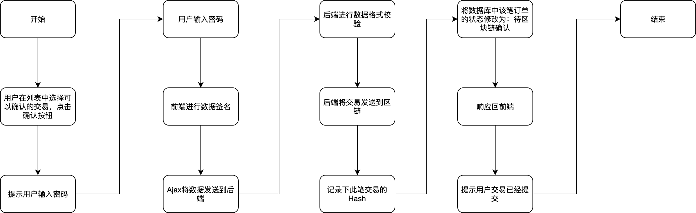
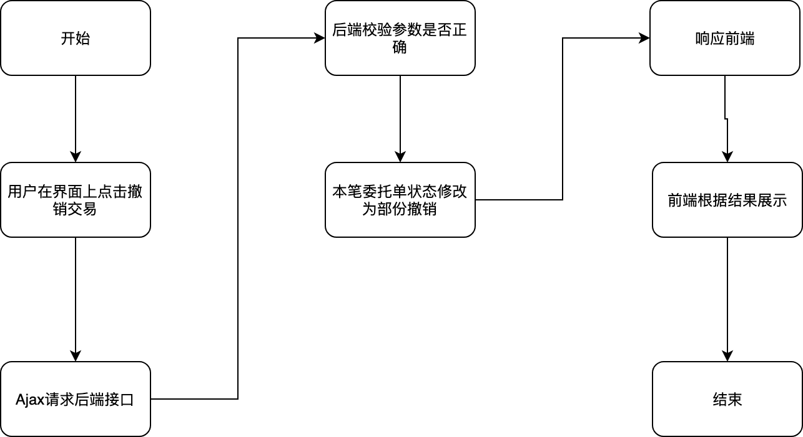
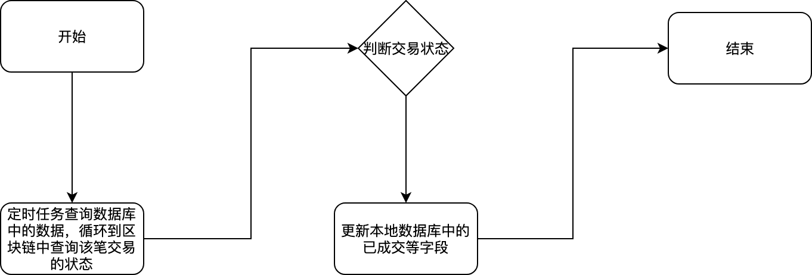

# nuls-switch

**本页主要内容** 

- [原型地址](#nuls-switch-原型地址)

- [需求说明书](#nuls-switch-需求说明书)

- [计划排期](#nuls-switch-计划排期)

- [任务计划](#nuls-switch-任务计划)

- [Dex设计](#nuls-switch-Dex设计) 

- - [整体架构](#nuls-switch-整体架构)

  - [技术框架](#nuls-switch-技术框架) 

  - - [前端应用](#nuls-switch-前端应用)
    - [后端应用](#nuls-switch-后端应用)
    - [数据库](#nuls-switch-数据库)
    - [账户模块](#nuls-switch-账户模块)
    - [Nuls主网](#nuls-switch-Nuls主网)

- [Dex流程](#nuls-switch-Dex流程) 

- - [账户相关](#nuls-switch-账户相关) 

  - - [获取Token](#nuls-switch-获取Token)
    - [导入账户](#nuls-switch-导入账户)

  - [交易相关](#nuls-switch-交易相关) 

  - - [我要买列表](#nuls-switch-我要买列表)
    - [用户购买](#nuls-switch-用户购买)
    - [用户点击我要卖按钮](#nuls-switch-用户点击我要卖按钮)
    - [用户出售](#nuls-switch-用户出售)
    - [用户确认交易](#nuls-switch-用户确认交易)
    - [用户撤销交易](#nuls-switch-用户撤销交易)

  - [定时任务](#nuls-switch-定时任务) 

  - - [卖家未确认的交易](#nuls-switch-卖家未确认的交易)
    - [确认交易](#nuls-switch-确认交易)

- [报文协议](#nuls-switch-报文协议) 

- - [账户相关](#nuls-switch-账户相关.1) 

  - - [获取Token](#nuls-switch-获取Token.1) 

    - - [请求参数](#nuls-switch-请求参数)
      - [响应参数](#nuls-switch-响应参数)

  - [交易相关](#nuls-switch-交易相关.1) 

  - - [查询支持的代币列表](#nuls-switch-查询支持的代币列表)

    - [查询当前用户的委托](#nuls-switch-查询当前用户的委托) 

    - - [请求参数](#nuls-switch-请求参数.1)
      - [响应参数](#nuls-switch-响应参数.1)

    - [查询当前交易对待出售的列表](#nuls-switch-查询当前交易对待出售的列表) 

    - - [请求参数](#nuls-switch-请求参数.2)
      - [响应参数　](#nuls-switch-响应参数.2)

    - [查询当前代币相关的待购买列表](#nuls-switch-查询当前代币相关的待购买列表) 

    - - [请求参数](#nuls-switch-请求参数.3)
      - [响应参数](#nuls-switch-响应参数.3)

    - [查询用户的指定代币余额](#nuls-switch-查询用户的指定代币余额) 

    - - [请求参数](#nuls-switch-请求参数.4)
      - [响应参数](#nuls-switch-响应参数.4)

    - [用户点击立即出售挂单](#nuls-switch-用户点击立即出售挂单) 

    - - [请求参数](#nuls-switch-请求参数.5)
      - [响应参数](#nuls-switch-响应参数.5)

    - [用户撤销挂单交易](#nuls-switch-用户撤销挂单交易) 

    - - [请求参数](#nuls-switch-请求参数.6)
      - [响应参数](#nuls-switch-响应参数.6)

    - [用户确认挂单交易](#nuls-switch-用户确认挂单交易) 

    - - [请求参数](#nuls-switch-请求参数.7)
      - [响应参数](#nuls-switch-响应参数.7)

    - [用户确认购买](#nuls-switch-用户确认购买) 

    - - [请求参数](#nuls-switch-请求参数.8)
      - [响应参数](#nuls-switch-响应参数.8)

    - [查询订单确认明细](#nuls-switch-查询订单确认明细) 

    - - [请求参数](#nuls-switch-请求参数.9)
      - [响应参数](#nuls-switch-响应参数.9)

    - [确认订单](#nuls-switch-确认订单) 

    - - [请求参数](#nuls-switch-请求参数.10)
      - [响应参数](#nuls-switch-响应参数.10)

    - [查询用户资产列表](#nuls-switch-查询用户资产列表) 

    - - [请求参数](#nuls-switch-请求参数.11)
      - [响应参数](#nuls-switch-响应参数.11)

    - [查询用户历史委托数据](#nuls-switch-查询用户历史委托数据) 

    - - [请求参数](#nuls-switch-请求参数.12)
      - [响应参数](#nuls-switch-响应参数.12)

# 原型地址

https://os999o.axshare.com/   罗鹏

[https://xbzast.axshare.com](https://xbzast.axshare.com/)   一峰

# 需求说明书

# 计划排期

| **任务大项**                   | **开始时间** | **结束时间** | **备注** |
| ------------------------------ | ------------ | ------------ | -------- |
| 整理用户场景以及基础技术预研   | 2019-7-8     | 2019-7-11    |          |
| 完成基于用户场景的任务划分     | 2019-7-12    | 2019-7-12    |          |
| 针对用户场景进行流程设计、编码 | 2019-7-15    | 2019-7-18    |          |
| 业务流程编码                   | 2019-7-19    | 2019-7-30    |          |

# 任务计划

| **任务大项** | **任务小项**                                                 | **责任人**                            | **开始时间** | **结束时间** | **备注**                                       |
| ------------ | ------------------------------------------------------------ | ------------------------------------- | ------------ | ------------ | ---------------------------------------------- |
| 后端         | 表结构设计                                                   | [秦一峰](file:////display/~qinyifeng) |              |              |                                                |
|              | 后台构架搭建                                                 | [陈学](file:////display/~chenxue)     |              |              |                                                |
|              | [实现获取Token后端接口](#nuls-switch-获取Token)              |                                       |              |              | 待确定:Token列表是从后端Or账户SDK获取          |
|              | [实现查询指定交易对的出售单列表(分页)接口](#nuls-switch-查询当前交易对待出售的列表) |                                       |              |              |                                                |
|              | [实现查询指定交易对的可购买单列表(分页)接口](#nuls-switch-我要买列表) |                                       |              |              |                                                |
|              | [实现查询支持的Token币种接口](#nuls-switch-查询支持的代币列表) |                                       |              |              |                                                |
|              | [实现查询用户的当前委托数据(分页)接口](#nuls-switch-查询当前用户的委托) |                                       |              |              |                                                |
|              | 实现查询用户的指定代币余额接口                               |                                       |              |              | 待确定:余额从后端获取Or账户SDK获取             |
|              | 实现用户出售挂单接口                                         |                                       |              |              |                                                |
|              | 实现用户撤销挂单接口                                         |                                       |              |              | 支持部份撤销或者全部撤销                       |
|              | 实现用户确认交易接口                                         |                                       |              |              | 有卖家或者买家吃单后，该笔订单发起方进行确认   |
|              | 实现用户购买接口                                             |                                       |              |              | 用户选择别人的挂单输入密码后向后端发起吃单请求 |
|              | 实现查询订单确认明细接口                                     |                                       |              |              |                                                |
|              | 实现确认订单接口                                             |                                       |              |              | 同实现用户确认交易接口                         |
|              | 实现查询用户资产列表接口                                     |                                       |              |              | 待确定:资产是从后端Or账户SDK获取               |
|              | 实现查询用户历史委托数据接口                                 |                                       |              |              |                                                |
| 前端         | 前端框架搭建                                                 |                                       |              |              |                                                |
|              | 实现我要买页面的业务逻辑功能                                 |                                       |              |              |                                                |
|              | 实现我要卖业务的业务逻辑功能                                 |                                       |              |              |                                                |
|              | 实现资产列表的业务逻辑功能                                   |                                       |              |              |                                                |
|              | 实现历史委托页面的业务逻辑功能                               |                                       |              |              |                                                |
| 定时任务     | 定时从区块链上获取用户的余额                                 |                                       |              |              | 待确定:余额从后端Or账户的SDK获取               |
|              | 定时从区块链上获取指定Hash的交易记录的状态并更新DEX数据库中订单状态 |                                       |              |              |                                                |
|              | 定时将超时未确认的订单撤销                                   |                                       |              |              |                                                |

# Dex设计

## 整体架构

整个应用共涉及到三个模块，整体架构如下

## 技术框架

### 前端应用

前端应用采用团队基于VUE的应用框架

### 后端应用

后端应用采用SpringBoot作为基础框架，对前端提供基于Restfull的接口供查询、修改数据

### 数据库

数据库采用Mysql，存储挂单数据、交易数据等

### 账户模块

核心团队提供账户模块供快捷的开户、访问账户信息等

### Nuls主网

Nuls主网提供交易数据的上链存储等

# Dex流程

## 账户相关

### 获取Token

用户在没有账户的情况下，可以创建新的账户。如果有账户，可以直接导入账户。

账户的创建以及导入都采用核心提供的WEB SDK。

### 导入账户

用户通过已存在的Keystore和密码导入已经存在的账户

## 交易相关

### 我要买列表

### 用户购买

### 用户点击我要卖按钮

### 用户出售

### 用户确认交易

 

### 用户撤销交易

## 定时任务

对于某些交易，需要定时任务处理。

### 卖家未确认的交易

对于卖家24小时未确认的交易，定时任务会自动取消

### 确认交易

对于发送到区块中的交易，定时任务会每2分钟查询区块链上的交易状态，如果为成功则会及时更新交易状态

# 报文协议

所有报文基于jsonrpc风格，对于数据获取类全部采用Http get，对于请求提交类全部采用Http post方法。

具体的接口协议，可以在启动后端工程后，通过访问 [http://ip:port/swagger.html](http://ipport) 地址信息获取

## 账户相关

### 获取Token

#### 请求参数

账户公钥

数字签名

#### 响应参数

账户地址

账户Token

## 交易相关

### 查询支持的代币列表

响应参数

支持的参数列表

### 查询当前用户的委托

#### 请求参数

用户Token

交易对

开始时间

结束时间

#### 响应参数

交易对

委托时间

### 查询当前交易对待出售的列表

#### 请求参数

交易对

出售数量

价格

#### 响应参数　

### 查询当前代币相关的待购买列表

#### 请求参数

交易对

出售数量

价格

#### 响应参数

### 查询用户的指定代币余额

#### 请求参数

#### 响应参数

### 用户点击立即出售挂单

#### 请求参数

#### 响应参数

### 用户撤销挂单交易

#### 请求参数

#### 响应参数

### 用户确认挂单交易

#### 请求参数

#### 响应参数

### 用户确认购买

#### 请求参数

#### 响应参数

### 查询订单确认明细

#### 请求参数

#### 响应参数

### 确认订单

#### 请求参数

#### 响应参数

### 查询用户资产列表

#### 请求参数

#### 响应参数

### 查询用户历史委托数据

#### 请求参数

#### 响应参数