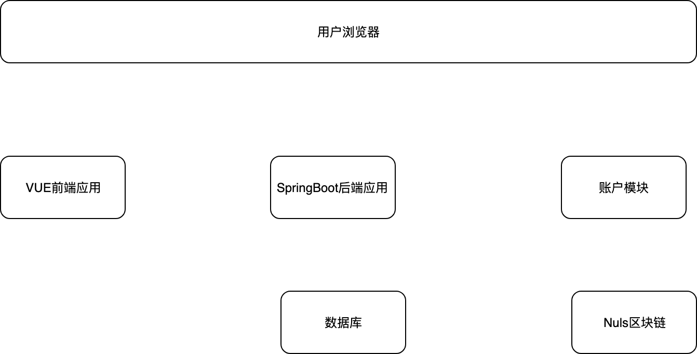
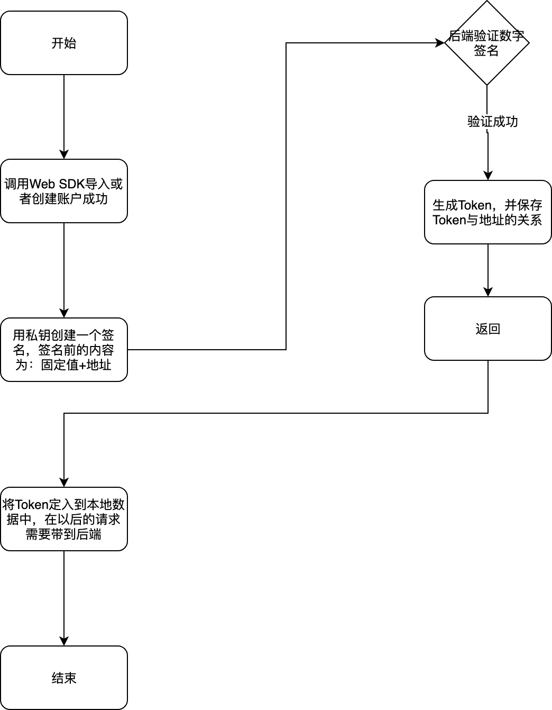
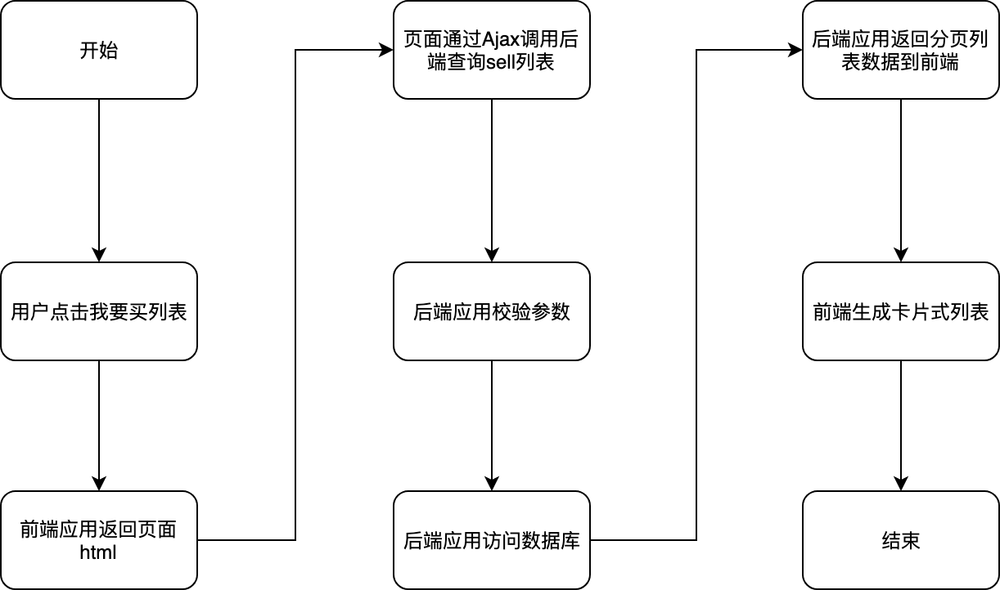
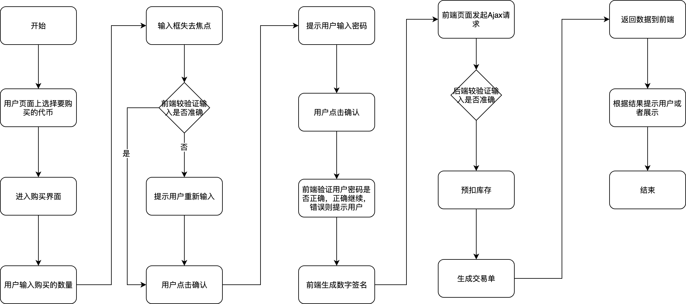
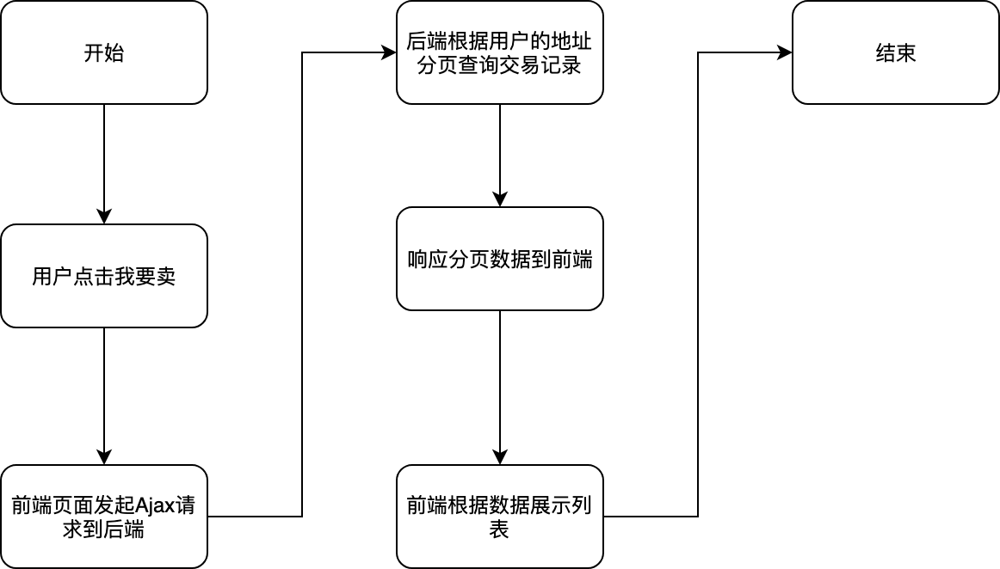
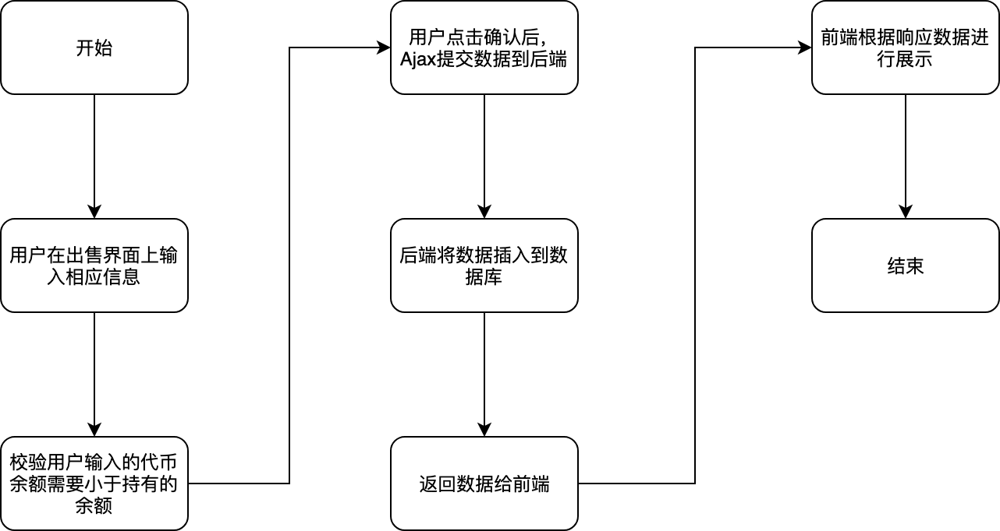
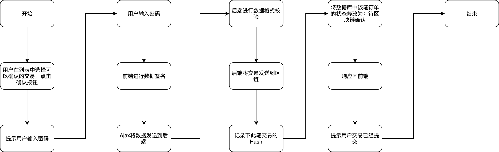
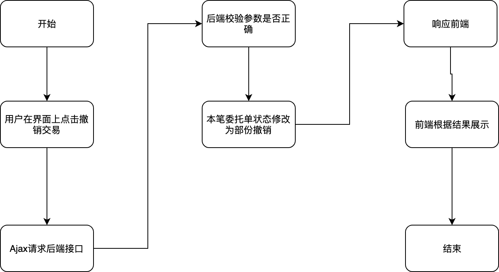
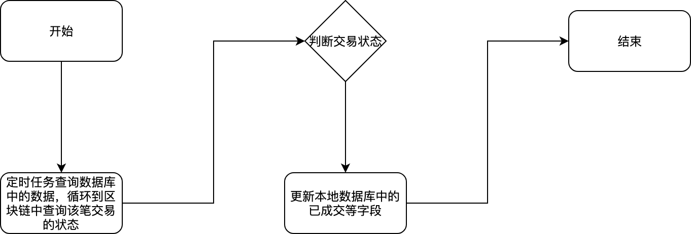

# nuls-switch

**本页主要内容** 

- [原型地址](#nuls-switch-原型地址)

- [需求说明书](#nuls-switch-需求说明书)

- [计划排期](#nuls-switch-计划排期)

- [任务计划](#nuls-switch-任务计划)

- [Dex设计](#nuls-switch-Dex设计) 

- - [整体架构](#nuls-switch-整体架构)

  - [技术框架](#nuls-switch-技术框架) 

  - - [前端应用](#nuls-switch-前端应用)
    - [后端应用](#nuls-switch-后端应用)
    - [数据库](#nuls-switch-数据库)
    - [账户模块](#nuls-switch-账户模块)
    - [Nuls主网](#nuls-switch-Nuls主网)

- [Dex流程](#nuls-switch-Dex流程) 

- - [账户相关](#nuls-switch-账户相关) 

  - - [获取Token](#nuls-switch-获取Token)
    - [导入账户](#nuls-switch-导入账户)

  - [交易相关](#nuls-switch-交易相关) 

  - - [我要买列表](#nuls-switch-我要买列表)
    - [用户购买](#nuls-switch-用户购买)
    - [用户点击我要卖按钮](#nuls-switch-用户点击我要卖按钮)
    - [用户出售](#nuls-switch-用户出售)
    - [用户确认交易](#nuls-switch-用户确认交易)
    - [用户撤销交易](#nuls-switch-用户撤销交易)

  - [定时任务](#nuls-switch-定时任务) 

  - - [卖家未确认的交易](#nuls-switch-卖家未确认的交易)
    - [确认交易](#nuls-switch-确认交易)

- [报文协议](#nuls-switch-报文协议) 

- - [账户相关](#nuls-switch-账户相关.1) 

  - - [获取Token](#nuls-switch-获取Token.1) 

    - - [请求参数](#nuls-switch-请求参数)
      - [响应参数](#nuls-switch-响应参数)

  - [交易相关](#nuls-switch-交易相关.1) 

  - - [查询支持的代币列表](#nuls-switch-查询支持的代币列表) 

    - - [请求参数](#nuls-switch-请求参数.1)
      - [响应参数](#nuls-switch-响应参数.1)

    - [查询当前用户的委托](#nuls-switch-查询当前用户的委托) 

    - - [请求参数](#nuls-switch-请求参数.2)
      - [响应参数](#nuls-switch-响应参数.2)

    - [查询当前交易对待出售的列表](#nuls-switch-查询当前交易对待出售的列表) 

    - - [请求参数](#nuls-switch-请求参数.3)
      - [响应参数　](#nuls-switch-响应参数.3)

    - [查询当前代币相关的待购买列表](#nuls-switch-查询当前代币相关的待购买列表) 

    - - [请求参数](#nuls-switch-请求参数.4)
      - [响应参数](#nuls-switch-响应参数.4)

    - [查询用户的指定代币余额](#nuls-switch-查询用户的指定代币余额) 

    - - [请求参数](#nuls-switch-请求参数.5)
      - [响应参数](#nuls-switch-响应参数.5)

    - [用户点击立即出售挂单](#nuls-switch-用户点击立即出售挂单) 

    - - [请求参数](#nuls-switch-请求参数.6)
      - [响应参数](#nuls-switch-响应参数.6)

    - [用户点击立即购买挂单](#nuls-switch-用户点击立即购买挂单) 

    - - [请求参数](#nuls-switch-请求参数.7)
      - [响应参数](#nuls-switch-响应参数.7)

    - [用户撤销挂单交易](#nuls-switch-用户撤销挂单交易) 

    - - [请求参数](#nuls-switch-请求参数.8)
      - [响应参数](#nuls-switch-响应参数.8)

    - [用户确认购买](#nuls-switch-用户确认购买) 

    - - [请求参数](#nuls-switch-请求参数.9)
      - [响应参数](#nuls-switch-响应参数.9)

    - [用户确认卖出](#nuls-switch-用户确认卖出) 

    - - [请求参数](#nuls-switch-请求参数.10)
      - [响应参数](#nuls-switch-响应参数.10)

    - [查询订单确认明细](#nuls-switch-查询订单确认明细) 

    - - [请求参数](#nuls-switch-请求参数.11)
      - [响应参数](#nuls-switch-响应参数.11)

    - [确认订单](#nuls-switch-确认订单) 

    - - [请求参数](#nuls-switch-请求参数.12)
      - [响应参数](#nuls-switch-响应参数.12)

    - [查询用户资产列表](#nuls-switch-查询用户资产列表) 

    - - [请求参数](#nuls-switch-请求参数.13)
      - [响应参数](#nuls-switch-响应参数.13)

    - [查询用户历史委托数据](#nuls-switch-查询用户历史委托数据) 

    - - [请求参数](#nuls-switch-请求参数.14)
      - [响应参数](#nuls-switch-响应参数.14)

# 原型地址

https://os999o.axshare.com/   罗鹏

[https://xbzast.axshare.com](https://xbzast.axshare.com/)   一峰

# 需求说明书

# 计划排期

| **任务大项**                   | **开始时间** | **结束时间** | **备注** |
| ------------------------------ | ------------ | ------------ | -------- |
| 整理用户场景以及基础技术预研   | 2019-7-8     | 2019-7-11    |          |
| 完成基于用户场景的任务划分     | 2019-7-12    | 2019-7-12    |          |
| 针对用户场景进行流程设计、编码 | 2019-7-15    | 2019-7-18    |          |
| 业务流程编码                   | 2019-7-19    | 2019-7-30    |          |

# 任务计划

| **任务大项** | **任务小项**                                                 | **责任人**                            | **开始时间** | **结束时间** | **备注**                                                     |
| ------------ | ------------------------------------------------------------ | ------------------------------------- | ------------ | ------------ | ------------------------------------------------------------ |
| 后端         | 表结构设计                                                   | [秦一峰](file:////display/~qinyifeng) | 2019-7-13    | 2019-7-14    | [nuls_switch_init.sql](file:////download/attachments/3637987/nuls_switch_init.sql%3fversion=3&modificationDate=1563200992000&api=v2) |
|              | 后台构架搭建                                                 | [陈学](file:////display/~chenxue)     |              |              |                                                              |
|              | [实现获取Token后端接口](#nuls-switch-获取Token)              | [陈学](file:////display/~chenxue)     |              |              | 待确定:Token列表是从后端Or账户SDK获取                        |
|              | [实现查询指定交易对的出售单列表(分页)接口](#nuls-switch-查询当前交易对待出售的列表) | [秦一峰](file:////display/~qinyifeng) |              |              |                                                              |
|              | [实现查询指定交易对的可购买单列表(分页)接口](#nuls-switch-我要买列表) | [秦一峰](file:////display/~qinyifeng) |              |              |                                                              |
|              | [实现查询支持的Token币种接口](#nuls-switch-查询支持的代币列表) | [秦一峰](file:////display/~qinyifeng) |              |              |                                                              |
|              | [实现查询用户的当前委托数据(分页)接口](#nuls-switch-查询当前用户的委托) | [陈学](file:////display/~chenxue)     |              |              |                                                              |
|              | 实现查询用户的指定代币余额接口                               | [陈学](file:////display/~chenxue)     |              |              | 待确定:余额从后端获取Or账户SDK获取                           |
|              | 实现用户出售挂单接口                                         | [秦一峰](file:////display/~qinyifeng) |              |              |                                                              |
|              | 实现用户撤销挂单接口                                         | [秦一峰](file:////display/~qinyifeng) |              |              | 支持部份撤销或者全部撤销                                     |
|              | 实现用户确认交易接口                                         | [陈学](file:////display/~chenxue)     |              |              | 有卖家或者买家吃单后，该笔订单发起方进行确认                 |
|              | 实现用户购买接口                                             | [秦一峰](file:////display/~qinyifeng) |              |              | 用户选择别人的挂单输入密码后向后端发起吃单请求               |
|              | 实现查询订单确认明细接口                                     | [陈学](file:////display/~chenxue)     |              |              |                                                              |
|              | 实现确认订单接口                                             | [陈学](file:////display/~chenxue)     |              |              | 同实现用户确认交易接口                                       |
|              | 实现查询用户资产列表接口                                     | [陈学](file:////display/~chenxue)     |              |              | 待确定:资产是从后端Or账户SDK获取                             |
|              | 实现查询用户历史委托数据接口                                 | [陈学](file:////display/~chenxue)     |              |              |                                                              |
| 前端         | 前端框架搭建                                                 | [秦一峰](file:////display/~qinyifeng) |              |              |                                                              |
|              | 实现我要买页面的业务逻辑功能                                 | [秦一峰](file:////display/~qinyifeng) |              |              |                                                              |
|              | 实现我要卖业务的业务逻辑功能                                 | [秦一峰](file:////display/~qinyifeng) |              |              |                                                              |
|              | 实现资产列表的业务逻辑功能                                   | [陈学](file:////display/~chenxue)     |              |              |                                                              |
|              | 实现历史委托页面的业务逻辑功能                               | [陈学](file:////display/~chenxue)     |              |              |                                                              |
| 定时任务     | 定时从区块链上获取用户的余额                                 | [陈学](file:////display/~chenxue)     |              |              | 待确定:余额从后端Or账户的SDK获取                             |
|              | 定时从区块链上获取指定Hash的交易记录的状态并更新DEX数据库中订单状态 | [陈学](file:////display/~chenxue)     |              |              |                                                              |
|              | 定时将超时未确认的订单撤销                                   | [陈学](file:////display/~chenxue)     |              |              |                                                              |

# Dex设计

## 整体架构

整个应用共涉及到三个模块，整体架构如下

## 技术框架

### 前端应用

前端应用采用团队基于VUE的应用框架

### 后端应用

后端应用采用SpringBoot作为基础框架，对前端提供基于Restfull的接口供查询、修改数据

### 数据库

数据库采用Mysql，存储挂单数据、交易数据等

### 账户模块

核心团队提供账户模块供快捷的开户、访问账户信息等

### Nuls主网

Nuls主网提供交易数据的上链存储等

# Dex流程

## 账户相关

### 获取Token

用户在没有账户的情况下，可以创建新的账户。如果有账户，可以直接导入账户。

账户的创建以及导入都采用核心提供的WEB SDK。

### 导入账户

用户通过已存在的Keystore和密码导入已经存在的账户

## 交易相关

### 我要买列表

### 用户购买

### 用户点击我要卖按钮

### 用户出售

### 用户确认交易

 

### 用户撤销交易

## 定时任务

对于某些交易，需要定时任务处理。

### 卖家未确认的交易

对于卖家24小时未确认的交易，定时任务会自动取消

### 确认交易

对于发送到区块中的交易，定时任务会每2分钟查询区块链上的交易状态，如果为成功则会及时更新交易状态

# 报文协议

所有报文基于restful风格，对于数据获取类全部采用Http get，对于请求提交类全部采用Http post方法。

具体的接口协议，可以在启动后端工程后，通过访问 [http://ip:port/swagger.html](http://ipport) 地址信息获取

## 账户相关

### 获取Token

url: /user/getToken

#### 请求参数

账户公钥、数字签名

{

"pubKey":"020fa96784862cb152cb0f67256db75a45137db3765057633a11dd199d3f66ef2e",

"digitalSignature":"nuls-switch-111111"

}

#### 响应参数

账户地址、账户Token

{

​    "code": 0,

​    "msg": "success",

​    "result": {

​          "address":"NseMUi1q9TefkXUcaysAuvFjj4NbTEST",

​          "token": "mytoken111111111"

​    }

}

## 交易相关

### 查询支持的代币列表

url: /tx/tokenPair/list

#### 请求参数

{

  "token": "mytoken111111111",

  "params": 

​    {

​    }

}

#### 响应参数

{

​    "code": 0,

​    "msg": "success",

​    "result": {

​    "list": 

​    [       

​    {

​        "fromTokenId":"1",

​        "fromTokenName":"NULS",

​        "toTokenList":

​        [  

​           {

​             "toTokenId":"2",

​             "toTokenName":"USDT"

​          }

​       ]

​    }

   ]

 }

}

### 查询当前用户的委托

url: /user/order/listCurrent

#### 请求参数

用户Token、交易对

{

  "token": "mytoken111111111",

  "params": 

​    {

​        "address":"NseMUi1q9TefkXUcaysAuvFjj4NbTEST",

​        "fromTokenId":"1",

​        "toTokenId":"2"

​    }

}

#### 响应参数

委托挂单ID、委托时间、交易对、价格、已交易数量、委托交易总量、总金额、状态

{

​    "code": 0,

​    "msg": "success",

​    "result": {

​    "list": 

​    [       

{

"orderId": 123,

"createTime": "2019-07-14 10:20:30",

"fromTokenId":"1",

"fromTokenName":"NULS",

"toTokenId":"2",

"toTokenName":"USDT",

"price": 1.2,

"txNum": 100,

"totalNum": 800,

"totalAmount": 960,

"status": 1

}

​    ]

 }

}

### 查询当前交易对待出售的列表

url: /tx/order/listOnSale

查询当前可购买的等待出售列表，排除自己发布的出售委托

#### 请求参数

用户Token、交易对

{

  "cmd": "queryOnSaleList",

  "token": "mytoken111111111",

  "params":

​    {

​        "fromTokenId":"1",

​        "toTokenId":"2",

**"tokenPair":"NULS_USDT"**,//对于交易对，考虑使用字符串还是ID？

​    }

}

#### 响应参数　

委托挂单ID、创建时间、单价、剩余可交易数量、剩余总金额

{

​    "code": 0,

​    "msg": "success",

​    "result": {

​    "list":

​    [       

{

"orderId": 123,

"createTime": "2019-07-14 10:20:30",

"price": 1.2,

"remainTxNum": 500,   //剩余可交易数量

"remainAmount": 600   //剩余总金额

}

​    ]

 }

}

### 查询当前代币相关的待购买列表

url: /tx/order/listOnBuy

查询当前可出售的等待购买列表，排除自己发布的购买委托

#### 请求参数

用户Token、交易对

{

  "token": "mytoken111111111",

  "params":

​    {

​        "fromTokenId":"1",

​        "toTokenId":"2"

​    }

}

#### 响应参数

委托挂单ID、创建时间、单价、剩余可交易数量、剩余总金额

{

​    "code": 0,

​    "msg": "success",

​    "result": {

​    "list":

​    [       

{

"orderId": 123,

"createTime": "2019-07-14 10:20:30",

"price": 1.2,

"remainTxNum": 500,   //剩余可交易数量

"remainAmount": 600   //剩余总金额

}

​    ]

 }

}

### 查询用户的指定代币余额

url: /user/token/getBalance

#### 请求参数

用户Token、交易对

{

  "token": "mytoken111111111",

  "params":

​    {

​        "tokenId":"1"

​    }

}

#### 响应参数

账户地址、tokenID，token名称、可用余额

{

​    "code": 0,

​    "msg": "success",

​    "result": {

"address":"NseMUi1q9TefkXUcaysAuvFjj4NbTEST",

"tokenId":"1",

"tokenName": "USDT",

"balance": 1000

​    }

}

### 用户点击立即出售挂单

url: /tx/order/sell

用户自助出售挂单

#### 请求参数

用户Token、交易对、单价、数量

{

  "token": "mytoken111111111",

  "params":

​    {

"fromTokenId": "1",

"toTokenId": "2",

"price": 1.5,

"txNum": 200

​    }

}

#### 响应参数

{

​    "code": 0,

​    "msg": "success",

​    "result": {

​    }

}

### 用户点击立即购买挂单

url: /tx/order/buy

用户自助买入挂单

#### 请求参数

用户Token、交易对、单价、数量

{

  "token": "mytoken111111111",

  "params":

​    {

"fromTokenId": "1",

"toTokenId": "2",

"price": 1.5,

"txNum": 200

​    }

}

#### 响应参数

{

​    "code": 0,

​    "msg": "success",

​    "result": {

​    }

}

### 用户撤销挂单交易

url: /tx/order/cancel

包括买入、卖出挂单

#### 请求参数

用户Token、委托挂单ID

{

  "token": "mytoken111111111",

  "params":

​    {

"orderId": "111111"

​    }

}

#### 响应参数

{

​    "code": 0,

​    "msg": "success",

​    "result": {

​    }

}

### 用户确认购买

url: /tx/order/buyToken

用户挂出买单，当其他人在此单上完成卖出操作后，用户需要再次确认才会完成交易（此时才组装交易数据上链）

#### 请求参数

用户Token、委托挂单ID、购买的tokenID，购买数量

{

  "token": "mytoken111111111",

  "params":

​    {

"orderId":  "111111",

"tokenId":  "1",

"txNum":  100

​    }

}

#### 响应参数

{

​    "code": 0,

​    "msg": "success",

​    "result": {

​    }

}

### 用户确认卖出

url: /tx/order/sellToken

#### 请求参数

用户Token、委托挂单ID、卖出的tokenID，卖出数量

{

  "token": "mytoken111111111",

  "params":

​    {

"orderId":  "111111",

"tokenId":  "1",

"txNum":  100

​    }

}

#### 响应参数

{

​    "code": 0,

​    "msg": "success",

​    "result": {

​    }

}

### 查询订单确认明细

url: /tx/order/detail

查询委托挂单与之相关的订单明细

#### 请求参数

用户Token、委托挂单ID

{

  "token": "mytoken111111111",

  "params":

​    {

​        "orderId": "111111"

​    }

}

#### 响应参数

委托挂单ID、订单交易明细ID、创建时间、交易数量、交易金额、状态

{

​    "code": 0,

​    "msg": "success",

​    "result": {

​    "list":

[       

{

"orderId": "111111",

"tradeId": "222222",

"createTime":  "2019-07-14 00:00:00",

"txNum":  100,

"txAmount":  300,

"status": 1

}

]

​    }

}

### 确认订单

url: /tx/order/confirm

#### 请求参数

用户Token、委托挂单ID、订单交易明细ID（用户买入、卖出）

{

  "cmd": "confirmTx",

  "token": "mytoken111111111",

  "params":

​    {

"orderId": "111111",

"tradeId": "222222"

​    }

}

#### 响应参数

{

​    "code": 0,

​    "msg": "success",

​    "result": {

​    }

}

### 查询用户资产列表

url: /user/asset/list

#### 请求参数

用户Token、地址

{

  "token": "mytoken111111111",

  "params": 

​    {

​        "address":"NseMUi1q9TefkXUcaysAuvFjj4NbTEST"

​    }

}

#### 响应参数

资产ID、资产名称、总数量、可用数量、冻结数量

{

​    "code": 0,

​    "msg": "success",

​    "result": {

​    "list": 

[       

{

"assetId": "1",

"assetName": "NULS",

"total": 1200,

"available": 1100,

"freeze": 100

}

]

​    }

}

### 查询用户历史委托数据

url: /user/order/listHis

#### 请求参数

用户Token、地址、开始时间、结束时间、交易对、状态

{

  "token": "mytoken111111111",

  "params": 

​    {

​        "address":"NseMUi1q9TefkXUcaysAuvFjj4NbTEST",

"startTime":"2019-07-14 00:00:00",

"endTime":"2019-07-14 23:59:59",

"fromTokenId":"1",

"toTokenId":"2",

"status":"1"

​    }

}

#### 响应参数

委托单ID、创建时间、原tokenID、原token名称、兑换目标tokenID、兑换目标tokenName、价格、已完成交易数量、总挂单委托数量、总金额、状态

{

​    "code": 0,

​    "msg": "success",

​    "result": {

"tokenList": 

[       

{

"orderId": 123,

"createTime": "2019-07-14 10:20:30",

"fromTokenId":"1",

"fromTokenName":"NULS",

"toTokenId":"2",

"toTokenName":"USDT",

"price": 1.2,

"txNum": 100,

"totalNum": 800,

"totalAmount": 960,

"status": 1

}

]

​    }

}

 