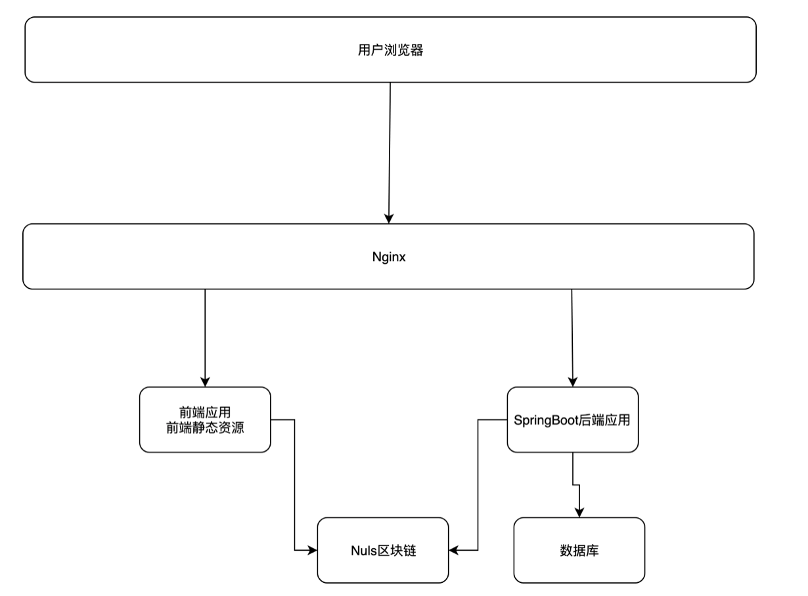

# switch部署说明书

# 1. 部署架构



# 2. 部署环境

## 2.1. 打包环境

在部署前，前端程序、后端程序都需要对程序进行打包。

| **程序类别** | **项**                   | **版本号**   | **备注** |
| ------------ | ------------------------ | ------------ | -------- |
| 前端程序     | yarn                     | 1.17.3       |          |
| 后端程序     | JDK                      | 11.0.1及以上 |          |
| Maven        | apache-maven-3.3.9及以上 |              |          |

## 2.2. 运行环境

| **项** | **版本**     | **备注** |
| ------ | ------------ | -------- |
| JDK    | 11.0.1及以上 |          |
| Nginx  | 1.15.8及以上 |          |
| Mysql  | 5.7.16及以上 |          |

# 3. Nginx部署

为提供统一的入口，系统采用Nginx作为反向代理接入，所有的请求通过Nginx进入后端系统。

Nginx配置

假设，switch站点的域名为switch.nuls.io，switch后端接口的域名为:api.switch.nuls.io，则相应的配置文件如下

```
    server {
        listen      80;
        server_name switch.nuls.com;
        location / {
          root   html/switch;
          index  index.html index.htm;
          #proxy_pass http://switch_web;
          #proxy_set_header  Host    $host;
          #proxy_set_header  X-Real-IP  $remote_addr;
          #proxy_set_header  X-Forwarded-For $proxy_add_x_forwarded_for;
        }
    }
 
 
 
 
    server {
 
        listen      80;
 
        server_name api.switch.nuls.com;
 
        location / {
 
          proxy_pass http://switch_tomcat;
 
          proxy_set_header  Host    $host;
 
          proxy_set_header  X-Real-IP  $remote_addr;
 
          proxy_set_header  X-Forwarded-For $proxy_add_x_forwarded_for;
 
        }
 
    }
```

# 4. 前端程序部署

前端程序部署方式为：通过yarn将前端程序打包为静态文件，然后将静态文件拷贝到Nginx的静态资源下。具体如下

## 4.1. 修改配置

在打包前，首先修改配置，需要修改的文件为：nuls-switch-web/src/config.js，修改项为：

```
export let NULS_API_URL = !IS_DEV ? 'http://192.168.1.40:18003/' : 'http://apitn1.nulscan.io/';

export let API_URL = IS_DEV ? 'http://api.switch.nuls.io/' : 'http://api.switch.nuls.io/';
```

假设NULS_API_URL的地址为：http://apitn1.nulscan.io，switch的域名为：switch.nuls.io，则修改配置文件中NULS_API_URL、API_URL的地址为：

```
export let NULS_API_URL = !IS_DEV ? 'http://apitn1.nulscan.io' : 'http://apitn1.nulscan.io';
export let API_URL = IS_DEV ? 'http://api.switch.nuls.io/' : 'http://api.switch.nuls.io/';
```

## 4.2. 打包程序

在nuls-switch-web目录下执行：yarn run build，如果执行成果，将会显示：DONE Build complete. The dist directory is ready to be deployed.

## 4.3. 发布前端程序

将nuls-switch-web/dist目录下所有的文件复制到Nginx的静态资源目录(一般为nginx安装目录下html目录)下switch目录下。

至此，前端程序部署完成。

 

# 5. 后端程序部署

## 5.1. 执行数据库脚本

在Mysql中创建nuls_switch数据库。

在nuls_switch数据库中执行nuls-switch-backend/src/resources/db/nuls_switch_init.sql脚本

## 5.2. 修改配置

### 5.2.1. 修改数据库地址

修改nuls-switch-backend/src/resources/application-test.yml文件，具体修改项为

- 修改datasource节点下url配置项中的IP地址、端口、数据库名称为switch数据库的ip地址、端口、数据库名称
- 修改datasource节点下username配置项的值为数据库用户名
- 修改datasource节点下password配置项的值为数据库密码

### 5.2.2. 修改nuls api节点地址

修改nuls-switch-backend/src/resources/application-test.yml文件，具体修改项为

- 修改nuls.api.address项的值为nuls api server节点地址，例如：[http://apitn1.nulscan.io](http://apitn1.nulscan.io/)

## 5.3. 打包程序

在nuls-switch-backend根目录下执行：mvn clean package -DskipTests，命令执行成功后，会在target目录下生成switch.jar文件

## 5.4. 发布文件

拷贝switch.jar文件到服务器，在同级目录下执行：nohup java -jar switch.jar --spring.profiles.active=test &

# 6. 初始化数据

通过之前的安装部署，系统已经可以访问了。

由于系统支持的交易对需要配置，所以还需要在数据库下执行如下脚本

```
--插入系统所支持的代币，例如：
--支持Nuls
insert into tx_token(token_type,chain_id,asset_id,token_symbol,token_name,decimals)
        values(1,2,1,'NULS','NULS','8')
--支持chainId为12，asset_id为1，token_symbol为BTC的跨链资产　
insert into tx_token(token_type,chain_id,asset_id,token_symbol,token_name,decimals)
        values(2,12,1,'BTC','BTC','8')
--假设tx_token表中生成的ID分别为1、2，则初始化NULS_BTC交易对的sql如下：
insert into tx_token_pair(from_token_id,to_token_id)
        values(1,2)
insert into tx_token_pair(from_token_id,to_token_id)
        values(2,1)
```

 

 


 
 

 

 

```
 
```

 

 